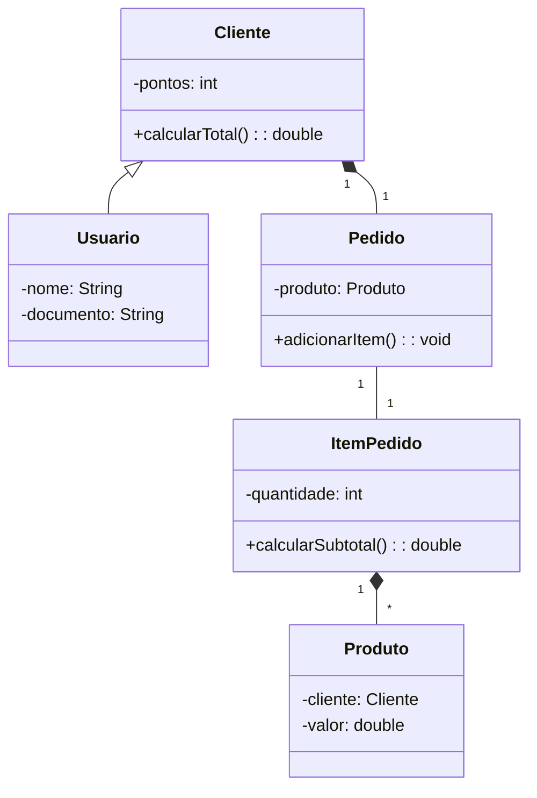

# UC4 — Aula 11 — Casos de uso e diagramas de classes

## Identificação

| Informação          | Preenchimento |
| ------------------- | ------------- |
| Nome completo       | Felipe Walker |
| Integrante da dupla | João Baum     |
| Turma               | TDS           |
| Data                | 24/09/26      |

## Orientações

Esta atividade utiliza o sistema da loja desenvolvido durante as aulas anteriores.

1. Preencha as respostas diretamente neste arquivo.
2. Substitua todos os campos `Digite aqui` pelas respostas da dupla.
3. Quando solicitado, justifique a resposta usando o código do projeto.
4. No exercício do diagrama, cole a imagem ou informe um link com permissão de visualização.
5. Entregue este arquivo preenchido no Google Classroom.
6. Antes de entregar, confira se o nome da dupla aparece no início do documento.

---

# Exercício 1 — Caso de uso da venda

Descreva o caso de uso **Realizar pedido**. Pense na funcionalidade pelo ponto de vista do cliente, sem explicar telas, botões ou comandos Java.

## 1.1 Identificação do caso de uso

| Item                | Resposta                                                   |
| ------------------- | ---------------------------------------------------------- |
| Nome do caso de uso | **Realizar pedido**                                        |
| Ator principal      | Cliente                                                    |
| Objetivo do ator    | Comprar produtos disponíveis na loja                       |
| Resultado esperado  | Pedido finalizado com sucesso com os itens e o valor total |

## 1.2 Pré-condições

O que precisa ser verdadeiro antes do pedido começar?

1. O cliente precisa estar cadastrado no sistema da loja com dados válidos (como CPF).
2. Deve existir pelo menos um produto cadastrado e disponível no catálogo.
3. O sistema da loja precisa estar ativo e pronto para registrar pedidos.

## 1.3 Fluxo principal

Descreva o caminho em que tudo acontece corretamente. Use entre sete e nove passos.

| Passo | Ação do ator ou resposta do sistema                                        |
| ----: | -------------------------------------------------------------------------- |
|     1 | O cliente inicia o processo de compra na loja.                             |
|     2 | O sistema apresenta a lista de produtos disponíveis no catálogo.           |
|     3 | O cliente escolhe um produto e informa a quantidade desejada.              |
|     4 | O sistema adiciona o item ao pedido e calcula o subtotal daquele item.     |
|     5 | O cliente repete a escolha para adicionar outros produtos, se quiser.      |
|     6 | O cliente pede para fechar o pedido.                                       |
|     7 | O sistema calcula o valor total somando todos os itens adicionados.        |
|     8 | O cliente escolhe a forma de pagamento e confirma a compra.                |
|     9 | O sistema processa o pagamento e exibe a confirmação do pedido finalizado. |

## 1.4 Fluxos alternativos

Descreva pelo menos duas situações em que o fluxo principal não pode continuar normalmente.

| Situação                                 | Em qual passo acontece? | Como o sistema deve responder?                                                           |
| ---------------------------------------- | ----------------------: | ---------------------------------------------------------------------------------------- |
| Código de produto não existe no catálogo |                       3 | O sistema informa que o produto não foi encontrado e pede para digitar um código válido. |
| Quantidade informada é zero ou negativa  |                       3 | O sistema avisa que a quantidade deve ser válida (maior que zero) e não adiciona o item. |

## 1.5 Pós-condições

Como o sistema deve estar depois que o caso de uso terminar corretamente?

1. O pedido fica registrado no sistema vinculado ao cliente correto.
2. O pagamento é concluído com sucesso.
3. A lista de itens do pedido fica gravada com seus respectivos subtotais e valor total final.

## 1.6 Regras de negócio

Registre pelo menos duas regras que o sistema precisa respeitar.

1. Todo pedido precisa obrigatoriamente estar associado a um cliente (não pode existir pedido sem cliente).
2. Um item de pedido precisa ter quantidade maior que zero e referenciar um produto existente.

---

# Exercício 2 — Radiografia da classe `Pedido`

Analise a classe `Pedido` do projeto e identifique o que o código revela sobre seus relacionamentos.

## 2.1 Relacionamentos encontrados

| Classes relacionadas     | Tipo de relacionamento | Multiplicidade  | Evidência encontrada no código                                                                                |
| ------------------------ | ---------------------- | --------------- | ------------------------------------------------------------------------------------------------------------- |
| `Pedido` e `Cliente`     | Associação simples     | `*` para `1`    | Atributo `private Cliente cliente;` e validação no construtor `if (cliente == null)`.                         |
| `Pedido` e `ItemPedido`  | Composição             | `1` para `0..*` | Atributo `private ArrayList<ItemPedido> itens;` e criação de `new ItemPedido(...)` dentro de `adicionarItem`. |
| `ItemPedido` e `Produto` | Associação simples     | `*` para `1`    | Atributo `private Produto produto;` recebido diretamente no construtor de `ItemPedido`.                       |

## 2.2 Justificativas

### A. Por que `Pedido` e `Cliente` não formam uma composição?

> **Resposta:** Porque o cliente existe sozinho antes e depois de qualquer pedido. Se o pedido for cancelado ou apagado do sistema, o cliente continua existindo normalmente com o cadastro dele intacto.

### B. Por que `Pedido` e `ItemPedido` podem ser representados por composição?

> **Resposta:** Porque um item de pedido só faz sentido e só existe dentro de um pedido específico. No código, o próprio método `adicionarItem()` dentro de `Pedido` é quem cria o `new ItemPedido(...)`. Se o pedido for destruído, a lista e todos os itens dele somem juntos.

### C. Por que `ItemPedido` conhece um `Produto`, mas não controla a existência dele?

> **Resposta:** Porque o produto faz parte do catálogo geral da loja. O `ItemPedido` só guarda uma referência para dizer qual produto foi comprado e calcular o subtotal. Se aquele item for removido do carrinho, o produto continua cadastrado na loja para outros clientes comprarem.

### D. No código atual, um `Pedido` pode ser criado sem itens. Qual multiplicidade representa essa situação: `0..*` ou `1..*`? Justifique.

> **Resposta:** A multiplicidade correta é `0..*`. Justificativa: No construtor `public Pedido(Cliente cliente)`, a lista é iniciada vazia com `this.itens = new ArrayList<>()`. Isso significa que o objeto `Pedido` nasce com zero itens e só recebe itens depois se alguém chamar o método `adicionarItem()`.

### E. O que precisaria mudar no código para podermos afirmar que todo pedido possui pelo menos um item?

> **Resposta:** Precisaríamos mudar o construtor da classe `Pedido` para receber obrigatoriamente pelo menos o primeiro `Produto` e sua quantidade (ou uma lista já contendo itens), colocando uma validação do tipo `if (produto == null)` ou `if (itens.isEmpty()) throw new IllegalArgumentException(...)`.

---

# Exercício 3 — Diagrama de classes da loja

Crie um diagrama de classes que represente o projeto atual.

O diagrama deve conter:

- `Usuario`;
- `Cliente`;
- `Pedido`;
- `ItemPedido`;
- `Produto`;
- atributos essenciais;
- métodos de negócio;
- visibilidade dos membros;
- relacionamentos;
- multiplicidades.

## 3.1 Planejamento das classes

Preencha a tabela antes de desenhar.

| Classe       | Responsabilidade                                              | Atributos essenciais                                                       | Métodos de negócio                                                                      |
| ------------ | ------------------------------------------------------------- | -------------------------------------------------------------------------- | --------------------------------------------------------------------------------------- |
| `Usuario`    | Classe base com os dados pessoais comuns a qualquer usuário   | `- nome: String`, `- email: String`, `- cpf: String`, `- telefone: String` | `+ exibirDados(): String`                                                               |
| `Cliente`    | Representar o cliente da loja e acumular pontos de fidelidade | `- codigo: int`, `- pontos: int`                                           | `+ adicionarPontos(quantidade: int): void`, `+ exibirDados(): String`                   |
| `Pedido`     | Gerenciar a compra de um cliente e calcular o total a pagar   | `- cliente: Cliente`, `- itens: ArrayList<ItemPedido>`                     | `+ adicionarItem(produto: Produto, quantidade: int): void`, `+ calcularTotal(): double` |
| `ItemPedido` | Representar uma linha do pedido (qual produto e a quantidade) | `- produto: Produto`, `- quantidade: int`                                  | `+ calcularSubtotal(): double`                                                          |
| `Produto`    | Classe abstrata base com os dados dos produtos à venda        | `# codigo: int`, `# nome: String`, `# preco: double`                       | `+ calcularPrecoFinal(): double`                                                        |

## 3.2 Planejamento dos relacionamentos

| Origem       | Destino      | Relação            | Multiplicidade  | Justificativa                                                                                      |
| ------------ | ------------ | ------------------ | --------------- | -------------------------------------------------------------------------------------------------- |
| `Cliente`    | `Usuario`    | Herança            | Não se aplica   | No código temos `Cliente extends Usuario`. Um cliente é uma especialização de usuário.             |
| `Cliente`    | `Pedido`     | Associação simples | `1` para `0..*` | Um cliente pode realizar nenhum ou vários pedidos, e cada pedido pertence a um cliente específico. |
| `Pedido`     | `ItemPedido` | Composição         | `1` para `0..*` | O pedido gerencia o ciclo de vida dos itens (`new ItemPedido`). Se o pedido sumir, os itens somem. |
| `ItemPedido` | `Produto`    | Associação simples | `*` para `1`    | Cada item de pedido aponta para um produto do catálogo para consultar preço e nome.                |

## 3.4 Conferência

Marque depois de revisar o diagrama:

- [x] Usei apenas classes existentes no projeto.
- [x] Os atributos pertencem às classes corretas.
- [x] Os métodos representam responsabilidades reais.
- [x] A herança aponta de `Cliente` para `Usuario`.
- [x] A composição está entre `Pedido` e `ItemPedido`.
- [x] As multiplicidades representam o código atual.
- [x] O diagrama não inventa atributos apenas para parecer completo.

---

# Exercício 4 — Diagrama com bugs

Uma dupla tentou representar o sistema da loja e produziu o modelo abaixo. Ele possui erros de herança, responsabilidade, relacionamento e multiplicidade.



Caso o seu editor não mostre o desenho, leia as relações do diagrama assim:

```text
Usuario ─────▷ Cliente

Cliente    1 ◆──────── 1 Pedido
Pedido     1 ───────── 1 ItemPedido
ItemPedido 1 ◆──────── * Produto
```

## 4.1 Encontre os problemas

Localize e explique pelo menos cinco erros.

| Erro encontrado                                            | Como deveria ficar                                                                 | Justificativa baseada no código ou na regra de negócio                                                                          |
| :--------------------------------------------------------- | :--------------------------------------------------------------------------------- | :------------------------------------------------------------------------------------------------------------------------------ |
| **1. Herança invertida** (`Cliente <\|-- Usuario`)         | `Usuario <\|-- Cliente`                                                            | No código, `Cliente extends Usuario`. Cliente é quem herda de Usuario, e não o contrário.                                       |
| **2. Composição entre `Cliente` e `Pedido`**               | Associação simples com multiplicidade `1` para `0..*`                              | Cliente não é composto por Pedido. Um cliente existe sem pedido, e se o pedido sumir o cliente continua existindo.              |
| **3. Relacionamento errado entre `Pedido` e `ItemPedido`** | Composição com multiplicidade `1` para `0..*` (`Pedido "1" *-- "0..*" ItemPedido`) | O pedido possui uma lista de itens (`ArrayList<ItemPedido>`). Além disso, os itens deixam de existir se o pedido for destruído. |
| **4. Composição de `ItemPedido` para `Produto`**           | Associação simples de `ItemPedido` para `Produto` (`*` para `1`)                   | O produto não morre se o item do pedido sumir; ele continua no catálogo. O item apenas aponta para 1 produto.                   |
| **5. Método `calcularTotal()` na classe `Cliente`**        | `calcularTotal()` deve ficar na classe `Pedido`                                    | Quem sabe o valor total da compra somando os itens é a classe `Pedido`, e não o `Cliente`.                                      |
| **6. Atributos em classes erradas**                        | Remover `produto` de `Pedido` e remover `cliente` de `Produto`                     | `Pedido` guarda uma lista de `ItemPedido` (e não um produto solto), e `Produto` não tem ligação nenhuma com `Cliente`.          |

## 4.2 Diagrama corrigido

Cole abaixo a imagem do diagrama corrigido ou informe um link compartilhado:

> **Imagem ou link do diagrama corrigido:**
>
> ```mermaid
> classDiagram
>     Usuario <|-- Cliente
>     Cliente "1" -- "0..*" Pedido
>     Pedido "1" *-- "0..*" ItemPedido
>     ItemPedido "*" --> "1" Produto
>
>     class Usuario {
>         -nome: String
>         -email: String
>         -cpf: String
>         -telefone: String
>         +exibirDados(): String
>     }
>
>     class Cliente {
>         -codigo: int
>         -pontos: int
>         +adicionarPontos(quantidade: int): void
>         +getDocumento(): String
>         +exibirDados(): String
>     }
>
>     class Pedido {
>         -cliente: Cliente
>         -itens: ArrayList~ItemPedido~
>         +adicionarItem(produto: Produto, quantidade: int): void
>         +calcularTotal(): double
>     }
>
>     class ItemPedido {
>         -produto: Produto
>         -quantidade: int
>         +calcularSubtotal(): double
>     }
>
>     class Produto {
>         <<abstract>>
>         #codigo: int
>         #nome: String
>         #preco: double
>         +calcularPrecoFinal()* double
>     }
> ```

## 4.3 Escolha mais importante

Qual correção foi a mais importante para o entendimento do sistema? Explique.

> **Resposta:** A correção da herança entre `Usuario` e `Cliente` e da composição entre `Pedido` e `ItemPedido`. Se a herança ficasse invertida, o conceito básico de orientação a objetos estaria quebrado, pois Usuario não é um tipo de Cliente. Além disso, arrumar o relacionamento de `Pedido` com `ItemPedido` deixa claro como o carrinho e as compras realmente funcionam no código.

---

# Reflexão final

## 1. Qual parte foi mais fácil: compreender o caso de uso ou compreender as classes? Por quê?

> **Resposta:** Compreender o caso de uso foi mais fácil porque pensamos na visão do usuário fazendo compras no dia a dia, enquanto nas classes precisamos olhar detalhes técnicos do código, como atributos, listas e tipos de relacionamento.

## 2. Qual relacionamento ainda causa dúvida na dupla?

> **Resposta:** A diferença prática entre associação simples, agregação e composição às vezes confunde na hora de desenhar e escolher a seta certa.

## 3. Em uma frase, explique por que o código e o diagrama precisam concordar.

> **Resposta:** Porque o diagrama serve de mapa para o sistema, e se ele mostrar coisas diferentes do código, ninguém consegue entender nem manter o projeto direito.

---

# Conferência antes da entrega

- [x] Preenchemos a identificação da dupla.
- [x] Respondemos todas as partes do exercício 1.
- [x] Justificamos os relacionamentos do exercício 2.
- [x] Inserimos a imagem ou o link do diagrama do exercício 3.
- [x] Encontramos pelo menos cinco erros no exercício 4.
- [x] Inserimos a imagem ou o link do diagrama corrigido.
- [x] Respondemos à reflexão final.
- [x] Conferimos se os links possuem permissão de visualização.
